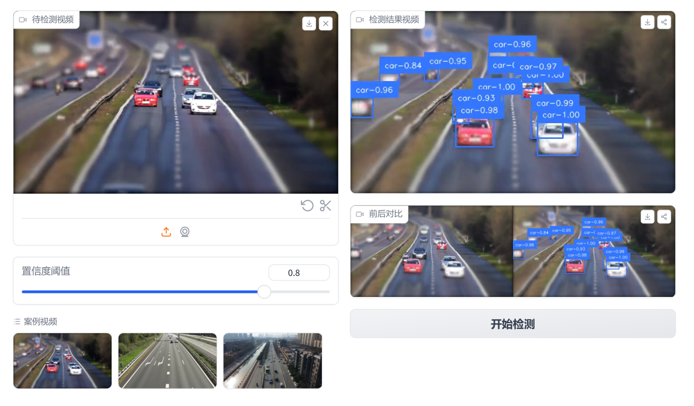

# video-object-detect-detr-bytetrack


应用创新实践课程、课号 C 208996400、视频目标检测系统设计与实现

## 环境

```bash
datasets
easydict
gradio
moviepy
numpy
opencv-python
scipy
supervision
timm
torch
torchvision
transformers[torch]
accelerate
albumentations
```

## 技术路线

在实际应用中，直接将基于图像的目标检测方法应用于视频目标检测往往效果不佳。这是因为视频中目标的运动状态、遮挡情况等会带来额外的挑战。为了解决这个问题，我们打算在现有的图像目标检测方法加以目标追踪模块，该模块**仅利用当前帧和历史帧信息**（不使用未来帧信息）实现**视频**目标检测。相比于传统的基于图像的方法，这种方法能够有效地处理**目标运动过程中的遮挡、形态变化以及方向变化**等问题。

初步方案：
对每帧做目标检测，然后连续的两帧之间以使用 `ByteTrack` 追踪器，融合前后的信息后, 最后拼接成视频。

## 训练脚本

如果🤔需要在自己的数据集上进行训练，参考unlock-hf项目中的基于DETR完成的目标检测任务的代码案例：

[DETR AND OBJECTDETECTION](https://moyanxinxu.github.io/unlock-hf/chapter6/container-detr/container-detr/)

### 分工

|  姓名  |                  职责                  |
| :----: | :------------------------------------: |
| 田健翔 |         整体架构、目标追踪算法         |
| 张栋梁 | 视频 demo 演示制作与网络可解释性可视化 |
| 王欣雨 |          gradio 前端界面搭建           |
| 尹潇逸 |   数据集格式转化与网络可解释性可视化   |

### demo



## 参考资料

| 内容                               | 网址                                                                                                                                             |
| ---------------------------------- | ------------------------------------------------------------------------------------------------------------------------------------------------ |
| HuggingFace DETR 模型训练教程      | [huggingface-object-detection](https://huggingface.co/tasks/object-detection)                                                                    |
| HUggingFace RT-DETR with ByteTrack | [RT-DETR-tracking-coco](https://huggingface.co/spaces/merve/RT-DETR-tracking-coco)                                                               |
| DETR 注意力机制可视化              | [DETR-Attention](https://colab.research.google.com/github/facebookresearch/detr/blob/colab/notebooks/detr_attention.ipynb#scrollTo=frMO0BaCYTEr) |
| Gradio 界面搭建文档                | [Gradio](https://www.gradio.app/)                                                                                                                |
