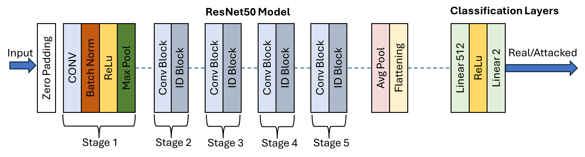
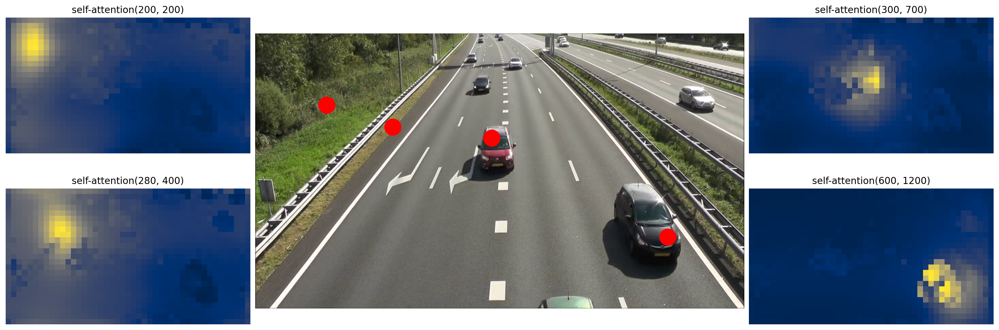
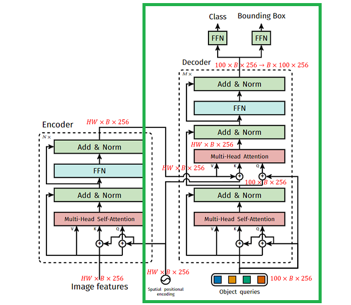
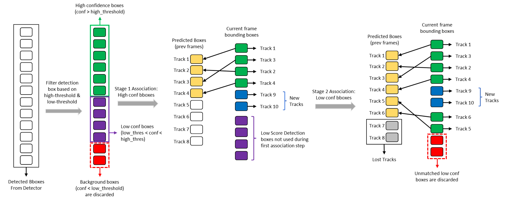
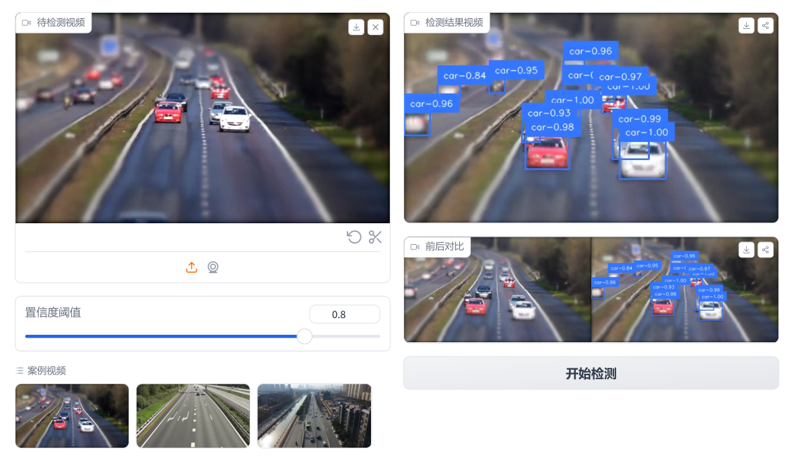

# 视频目标检测系统设计与实现

`DETR` + `ByteTrack`

> 田健翔、尹潇逸、张栋梁、王欣雨

---

|            功能            | 完成情况 |    参与人员     |
| :----------------------: | :--: | :---------: |
|         DETR 网络          |  ✅   |     田健翔     |
|          追踪算法研究          |  ✅   | 田健翔、尹潇逸、张栋梁 |
|    网络可解释性、数据集选择与格式转化     |  ✅   |   尹潇逸、张栋梁   |
| Gradio 界面搭建、视频 Demo 演示制作 |  ✅   | 王欣雨、尹潇逸、张栋梁 |

|    模型     |            不足            |         可拓展之处          |
| :-------: | :----------------------: | :--------------------: |
|   DETR    |    小目标检测效果仍不好、模型参数量大     | 多尺度特征融合、注意力机制优化、模型量化压缩 |
| ByteTrack | 对遮挡目标的跟踪效果仍然不佳、轨迹平滑度有待提升 |  遮挡处理机制（卡尔曼滤波）、轨迹平滑算法  |

---

## 背景意义

当下，计算机视觉技术正在成为推动社会进步的重要力量，其中**视频目标检测技术**作为其重要分支，已经在安防监控、军事侦察、自动驾驶、人机交互等领域展现出巨大的应用价值。所以进一步研究视频目标检测是非常有必要的。


---
## 背景意义

相比于较为成熟的基于单帧的目标检测，视频目标检测在实际应用中，仍然面临着诸多挑战，例如目标物体被遮挡、发生形变、出现多个相似目标、运动模糊以及光照变化等问题。为了解决这些挑战，我们团队结合了最先进的目标检测模型与目标追踪技术（`DETR` 与 `ByteTrack`）。我们的方案能够有效地应对上述挑战，并在智能交通车辆与行人检测中取得了显著的效果。

---
## 技术方案 ：

1. 对每帧图像进行目标检测（采用 `DETR` 目标检测模型）
2. 结合上文信息，利用前帧信息得到**预测值**，然后结合下帧**观测值**，在下帧更新目标信息。

---
## DEtection TRansformer (DETR)

论文地址：https://arxiv.org/pdf/2005.12872


---

### BackBone 模块



---


### Encoder 模块


---

### 位置编码部分

`DETR` 依旧是使用正余弦编码的方式进行位置编码，但是是对 $x$, $y$ 两个方向同时编码，每个方向各编码 128 维向量，这种编码方式更符合**图像**的特点。

|                                           $x$ 方向                                           |                                           $y$方向                                            |
| :----------------------------------------------------------------------------------------: | :----------------------------------------------------------------------------------------: |
|    $PE(pos_x, 2i) = \sin\left(\frac{pos_x}{10000^{\frac{2i}{d_{\text{model}}}}}\right)$    |  $PE (pos_y, 2 i) = \sin\left (\frac{pos_y}{10000^{\frac{2 i}{d_{\text{model}}}}}\right)$  |
| $PE (pos_x, 2 i+1) = \cos\left (\frac{pos_x}{10000^{\frac{2 i}{d_{\text{model}}}}}\right)$ | $PE (pos_y, 2 i+1) = \cos\left (\frac{pos_y}{10000^{\frac{2 i}{d_{\text{model}}}}}\right)$ |


*  $pos_x$ $pos_y$ 分别表示二维空间中的横纵坐标
*  $i$ 是编码向量维度索引，取值范围为 $0$ 到 $d_{\text{model}}/2 - 1$
*  $d_{\text{model}}$ 是编码向量的维度

---

### 注意力机制




---

### 解码器部分





---

### `YOLO` VS `DETR`

|  特性  | YOLO                         | DETR                                        |
| :--: | :--------------------------- | :------------------------------------------ |
| 实时性  | **高** 速度极快，适合实时应用            | **较低** 速度较慢，难以满足实时性要求                       |
|  精度  | **中等** 整体精度较好，但对小目标检测精度较低    | **高** 对小目标检测精度较高，整体精度也更高                    |
| 训练难度 | **较低** 训练过程相对稳定，超参数调整难度较低    | **较高** Transformer 模型训练难度较大，超参数调整也相对困难      |
| 部署成本 | **低** 模型结构简单，参数量较少，计算量低，易于部署 | **高** Transformer 模型计算量大，对硬件性能要求较高，部署成本相对较高 |

---

## ByteTrack

论文地址：https://arxiv.org/pdf/2110.06864




---





---


|  特性  | DeepSORT                    | ByteTrack                              |
| :--: | :-------------------------- | :------------------------------------- |
| 核心思想 | 深度学习提取特征 + 数据关联             | 将追踪转化为关联问题，通过关联矩阵匹配目标和检测框              |
| 特征提取 | 使用深度学习模型提取外观特征              | 无需显式提取特征，直接利用检测框信息                     |
| 数据关联 | 匈牙利算法 + 外观特征 + 运动信息         | 基于关联矩阵，利用检测框的位置、大小、置信度等信息              |
|  优势  | **精准**: 对目标外观变化鲁棒性强，追踪精度高   | **高效**: 速度更快，实现简单，易于部署                 |
|  劣势  | **耗时**: 计算量大，速度较慢，依赖高质量检测结果 | **易混淆**: 对目标外观变化鲁棒性稍弱，误检/漏检多时易出现目标 ID 切换 |


---
## 数据集

| 特性    | Objects365              | COCO                   |
| ----- | ----------------------- | ---------------------- |
| 图像数量  | 训练集: 600000, 验证集: 30000 | 训练集: 118000, 验证集: 5000 |
| 类别数量  | 365                     | 80                     |
| 标注框数量 | 10000000                | 1500000                |
| 图像场景  | 日常生活场景                  | 日常生活和复杂场景              |
| 标注难度  | 高                       | 高                      |
| 主要优势  | 数据规模大，类别丰富              | 数据集成熟，应用广泛             |
| 主要劣势  | 类别数量多，训练难度大             | 数据规模相对较小               |

---


```json
{
  "folder": "string",
  "filename": "string",
  "source": {
    "database": "string",
    "annotation": "string",
    "image": "string"
  },
  "size": {
    "width": "integer",
    "height": "integer",
    "depth": "integer"
  },
  "segmented": "integer",
  "object": [
    {
      "name": "string",
      "pose": "string",
      "truncated": "integer",
      "difficult": "integer",
      "bndbox": {
        "xmin": "integer",
        "ymin": "integer",
        "xmax": "integer",
        "ymax": "integer"
      }
    },
    ...
  ]
}
```

---


|        字段         |          说明           | 类型  |
| :---------------: | :-------------------: | :-: |
|      folder       |        图像所属文件夹        | 字符串 |
|     filename      |         图像文件名         | 字符串 |
|  source.database  |         数据集名称         | 字符串 |
| source.annotation |         标注版本          | 字符串 |
|   source.image    |         图像来源          | 字符串 |
|    size.width     |         图像宽度          | 整数  |
|    size.height    |         图像高度          | 整数  |
|    size.depth     |         图像通道数         | 整数  |
|     segmented     | 是否用于分割任务 (1: 是, 0: 否) | 整数  |


---

|       object       |    物体标注信息，可包含多个物体     |     |
| :----------------: | :-------------------: | :-: |
|    object.name     |        物体类别名称         | 字符串 |
|    object.pose     |         拍摄角度          | 字符串 |
|  object.truncated  | 物体是否被截断 (1: 是, 0: 否)  | 整数  |
|  object.difficult  | 目标是否难以识别 (1: 是, 0: 否) | 整数  |
| object.bndbox.xmin |      边界框左上角 x 坐标      | 整数  |
| object.bndbox.ymin |      边界框左上角 y 坐标      | 整数  |
| object.bndbox.xmax |      边界框右下角 x 坐标      | 整数  |
| object.bndbox.ymax |      边界框右下角 y 坐标      | 整数  |

---

## 预训练模型

基于 Objects 365 数据集进行实验。

| 模型                           | AP   | AP 50 | AP 75 |
| ---------------------------- | ---- | ---- | ---- |
| RT-DETR-R 18                  | 46.5 | 63.8 | 50.4 |
| RT-DETR R 50                  | 53.1 | 71.3 | 57.7 |
| RT-DETR R 101                 | 54.3 | 72.7 | 58.6 |
| RT-DETR-R 18 (Objects 365 预训练)  | 49.2 | 66.6 | 53.5 |
| RT-DETR-R 50 (Objects 365 预训练)  | 55.3 | 73.4 | 60.1 |
| RT-DETR-R 101 (Objects 365 预训练) | 56.2 | 74.6 | 61.3 |

---



---
